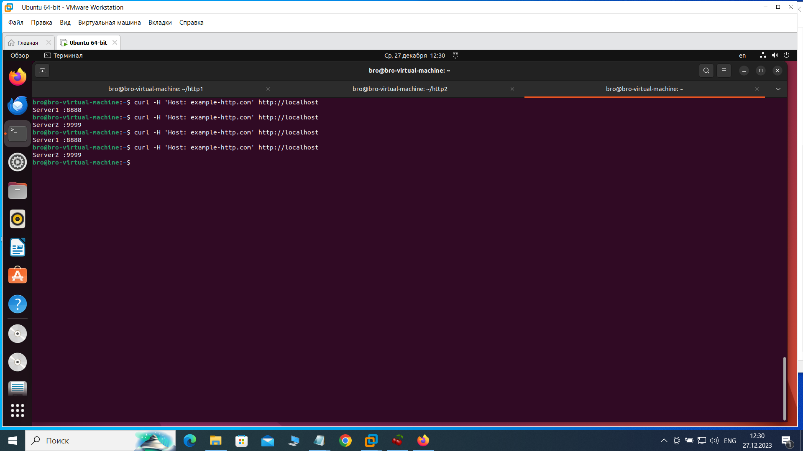

Домашнее задание «Кластеризация и балансировка нагрузки» Брюхов А Sys-26

Решение 1

1.Создаем mkdir http1 и mkdir http2
2.переходим cd http1 и cd http2
3.nano index.html 

Server1 :8888 и Server2 :9999 соответственно

4.запускаем python3 -m http.server 8888 --bind 0.0.0.0
            python3 -m http.server 9999 --bind 0.0.0.0

5.проверяем curl http://localhost:8888
            Server 1 :8888
            curl http://localhost:9999
            Server 2 :9999
6.устанавливаем sudo apt install nginx
( конфиг /etc/nginx/nginx.conf
         /etc/nginx/sites-enabled/default)
7.перед каждым запуском проверяем 
 sudo nginx -t
nginx: the configuration file /etc/nginx/nginx.conf syntax is ok
nginx: configuration file /etc/nginx/nginx.conf test is successful
8.запускаем sudo systemctl start nginx
9.проверяем curl http://localhost
<title>Welcome to nginx!</title>
10.создаем файл sudo nano /etc/nginx/conf.d/example-http.conf с содержимым:

include /etc/nginx/include/upstream.inc;

server {
    listen       80;
    server_name  example-http.com;

    access_log /var/log/nginx/example-http.com-acess.log;
    error_log /var/log/nginx/example-http.com-error.log;

    location / {
        proxy_pass http://example_app; # запомним
    }
}

11.создаем файл в sudo mkdir /etc/nginx/include:

sudo nano /etc/nginx/include/upstream.inc

upstream example_app {

        server 127.0.0.1:8888;
        server 127.0.0.1:9999;

}
12.проверим конфиги sudo nginx -t
13.выполним systemctl reload nginx
14.обращаемся к серверу на порту 80 локально
curl -H 'Host: example-http.com' http://localhost

Решение 2

1.sudo apt-get install haproxy
2.файл sudo nano /etc/haproxy/haproxy.cfg
в конец 

global
	log /dev/log	local0
	log /dev/log	local1 notice
	chroot /var/lib/haproxy
	stats socket /run/haproxy/admin.sock mode 660 level admin expose-fd listeners
	stats timeout 30s
	user haproxy
	group haproxy
	daemon

	# Default SSL material locations
	ca-base /etc/ssl/certs
	crt-base /etc/ssl/private

	# See: https://ssl-config.mozilla.org/#server=haproxy&server-version=2.0.3&config=intermediate
        ssl-default-bind-ciphers ECDHE-ECDSA-AES128-GCM-SHA256:ECDHE-RSA-AES128-GCM-SHA256:ECDHE-ECDSA-AES256-GCM-SHA384:ECDHE-RSA-AES256-GCM-SHA384:ECDHE-ECDSA-CHACHA20-POLY1305:ECDHE-RSA-CHACHA20-POLY1305:DHE-RSA-AES128-GCM-SHA256:DHE-RSA-AES256-GCM-SHA384
        ssl-default-bind-ciphersuites TLS_AES_128_GCM_SHA256:TLS_AES_256_GCM_SHA384:TLS_CHACHA20_POLY1305_SHA256
        ssl-default-bind-options ssl-min-ver TLSv1.2 no-tls-tickets

defaults
	log	global
	mode	http
	option	httplog
	option	dontlognull
        timeout connect 5000
        timeout client  50000
        timeout server  50000
	errorfile 400 /etc/haproxy/errors/400.http
	errorfile 403 /etc/haproxy/errors/403.http
	errorfile 408 /etc/haproxy/errors/408.http
	errorfile 500 /etc/haproxy/errors/500.http
	errorfile 502 /etc/haproxy/errors/502.http
	errorfile 503 /etc/haproxy/errors/503.http
	errorfile 504 /etc/haproxy/errors/504.http

listen stats  # веб-страница со статистикой
        bind                    :888
        mode                    http
        stats                   enable
        stats uri               /stats
        stats refresh           5s
        stats realm             Haproxy\ Statistics

frontend example  # секция фронтенд
        mode http
        bind :8088
        #default_backend web_servers
	acl ACL_example.com hdr(host) -i example.com
	use_backend web_servers if ACL_example.com

backend web_servers    # секция бэкенд
        mode http
        balance roundrobin
        option httpchk
        http-check send meth GET uri /index.html
        server s1 127.0.0.1:8888 check
        server s2 127.0.0.1:9999 check
        server s3 127.0.0.1:8899 check

listen web_tcp

	bind :1325

	server s1 127.0.0.1:8888 check inter 3s
	server s2 127.0.0.1:9999 check inter 3s
        server s3 127.0.0.1:8899 check inter 3s

3.перезапуск systemctl reload haproxy

4.проверяем curl http://127.0.0.1:8088 -H "Host: example.com"

